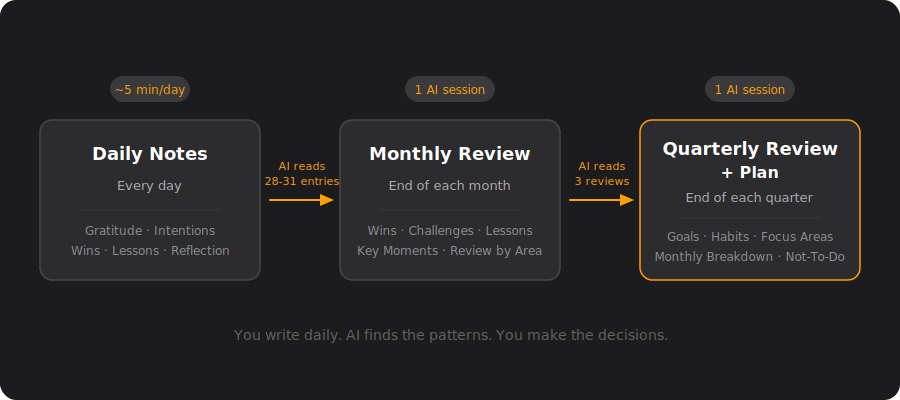
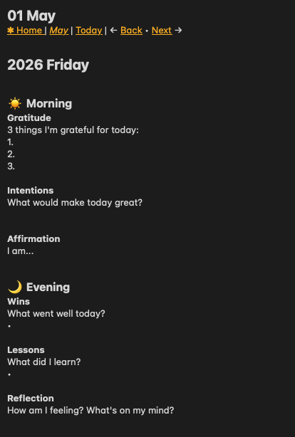
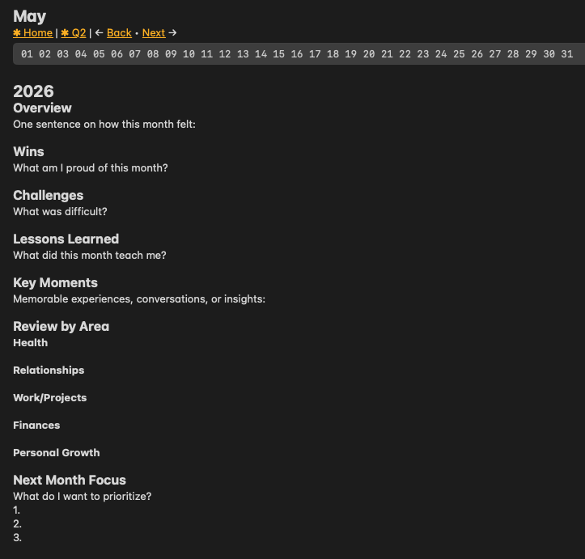
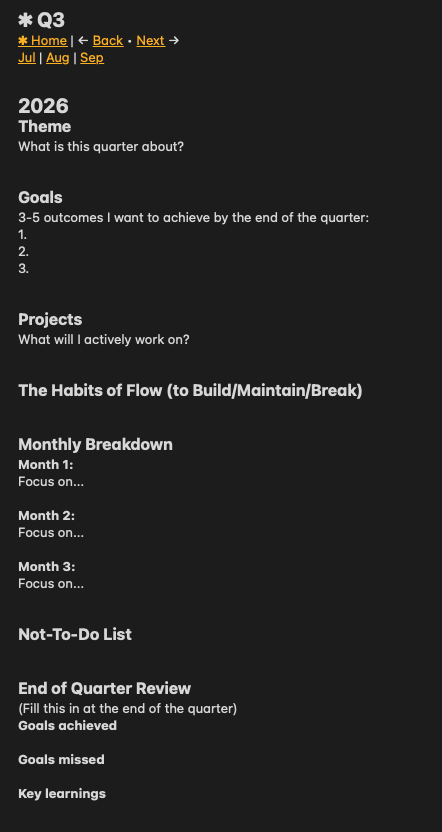

# AI Journal Review - Skills

A personal journaling system that uses AI to turn daily notes into monthly reviews and quarterly plans.

Write daily notes by hand. Let AI find the patterns.

## How it works



1. **Daily notes** — Every day, fill out a short template: morning (gratitude, intentions, affirmation) and evening (wins, lessons, reflection). Keep it in whatever note-taking app works for you.



2. **Monthly review** — At the end of each month, AI reads all daily entries and synthesizes a structured review: wins, challenges, lessons learned, key moments, a review by area (health, relationships, work, finances, personal growth), and priorities for next month.



3. **Quarterly review** — At the end of each quarter, AI reads all 3 monthly reviews plus your quarterly goals. It produces a close-out of the ending quarter and a full plan for the next one — theme, goals, habits to build or break, monthly breakdown, and a not-to-do list.



## What's in this repo

```
ai-journal-review/
├── templates/
│   ├── daily-note.md        ← Fill this out every day
│   ├── monthly-note.md      ← AI fills this at month-end
│   └── quarterly-note.md    ← AI fills this at quarter-end
└── skills/
    ├── monthly-review/
    │   └── SKILL.md          ← Instructions for AI to run the monthly review
    └── quarterly-review/
        └── SKILL.md          ← Instructions for AI to run the quarterly review
```

### Templates

Copy these into your note-taking app. The daily template is designed to take 5 minutes in the morning and 5 minutes in the evening. Not every section needs to be filled every day — partial entries are normal and expected.

### Skills

The skill files are structured instructions that tell an AI assistant how to read your notes and produce the reviews. I use these skills with Claude Cowork (Claude Desktop App).

To use them:
1. Connect the Apple Notes connector on the Claude Desktop App
2. Add the skill files to the Customize section on the Claude Desktop App
3. Tell it which month or quarter to review

## Getting started

1. Copy the daily note template into your note-taking app
2. Journal daily for at least one month (morning and/or evening — both is ideal)
3. At month-end, use the monthly review skill with an AI assistant
4. After 3 months, use the quarterly review skill

The daily habit is the foundation. Start there. The reviews only work if you have entries to analyze.

## Why this exists

I journaled daily for 6 months and manually wrote monthly reviews. It worked, but I was only catching what I remembered. When I ran AI across all my entries, it found patterns I'd missed entirely: recurring frustrations across weeks, habits forming without me tracking them, connections between a lesson in one month and a win two months later.

The quarterly review is where it gets powerful. Instead of guessing what to focus on next, AI recommends goals, habits, and monthly priorities based on 90 days of actual data about your life.

## Credits

The journal format was inspired by [My Forever Notes](https://www.myforevernotes.com/docs/journal). I adapted the template for my own workflow and built the AI automation layer on top.

## License

MIT
